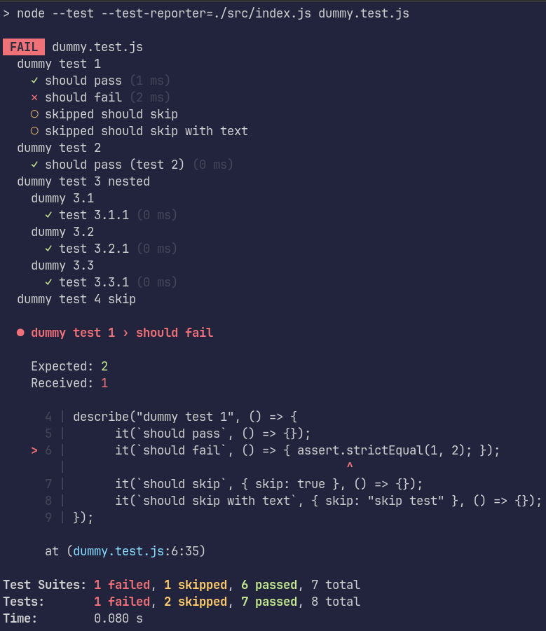

# node-test-reporter

This is a lightweight custom reporter for Node's built-in test runner, which was introduced in v18.0.0 and v16.17.0. This reporter adaptes the Jest-style, which is shown in the snapshot below. However this is a hobby project, lots of features, like snapshots, diff highlighter are not implemented. For serious projects, use Mocha, Jest, or Vitest, or even the built-in reporters from `node:test`.



## How to Use

First install it as a dependency to a project:

```bash
npm i -D @ironblood/node-test-reporter
```

Then pass it to [`--test-reporter`](https://nodejs.org/api/cli.html#--test-reporter), which was introduced in v19.6.0 and v18.15.0:

```bash
node --test --test-reporter=@ironblood/node-test-reporter path/to/foo.test.js
```
